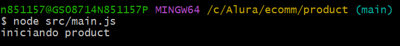
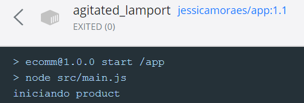
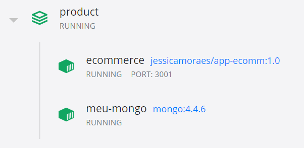

 ## Sprint 1
 ### 🌱 Atividade essencial
 
 

 
 

 
 - [x] Crie um novo repositório no GitHub chamado `ecomm`.
 - [x] Clone o repositório para sua máquina.
 - [x] Crie uma pasta chamada `product` na raiz do repositório e dentro dela Inicialize um projeto Node na raiz do repositório usando `npm init`.
 - [x] Crie um arquivo chamado `main.js` dentro da pasta product/src que simplesmente faz log da mensagem: `iniciando product`.
 - [x] Execute esse arquivo com o Node e valide que a mensagem está sendo impressa no terminal.
 - [x] Faça commit das suas mudanças.

### 🍃 Atividade desejável

- [x] Crie um arquivo `Dockerfile` dentro da pasta `product` no repositório.
- [x] Use as instruções necessárias para copiar tudo que estiver na pasta `src` dentro da pasta `product` para dentro da Imagem.
- [x] Configure o comando base de inicialização do container dessa imagem para executar o arquivo `main.js` que está dentro de `src`.
- [x] Faça o `build` dessa imagem, crie um container a partir dela e verifique se nos logs do container, a mensagem de `log` que criamos na tarefa anterior é exibido.

### 🌳 Atividade desafio

- [x] Crie um arquivo docker-compose.yml na raiz do repositório.
- [x] Faça com que ao executar o comando docker-compose up, o container da aplicação product seja criado se necessário e executado.
- [x] Ao fazer docker-compose down este mesmo container deve ser destruído.

 
 

