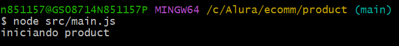

 - [x] Crie um novo repositório no GitHub chamado ecomm.
 - [x] Clone o repositório para sua máquina.
 - [x] Crie uma pasta chamada product na raiz do repositório e dentro dela Inicialize um projeto Node na raiz do repositório usando npm init.
 - [x] Crie um arquivo chamado main.js dentro da pasta product/src que simplesmente faz log da mensagem: iniciando product.
 - [x] Execute esse arquivo com o Node e valide que a mensagem está sendo impressa no terminal.

 
 
 - [x]Faça commit das suas mudanças.
